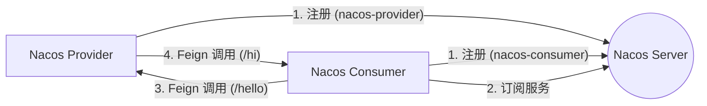

# Nacos & Feign 核心知识点指南

## 1. Nacos (Dynamic Naming and Configuration Service)

### 1.1 什么是 Nacos？
Nacos 是阿里巴巴开源的一个致力于服务发现、配置管理和服务管理平台。它旨在帮助您更敏捷地构建、交付和管理微服务。

### 1.2 核心功能
1.  **服务发现 (Service Discovery)**
    *   **服务注册**: 服务启动时，将自己的网络地址（IP:Port）和元数据注册到 Nacos Server。
    *   **服务发现**: 消费者服务通过 Nacos Server 查询目标服务的列表（健康实例）。
    *   **健康检查**: Nacos 会定期检查注册的服务实例是否健康，若不健康则将其从列表中剔除。
2.  **动态配置管理 (Dynamic Configuration)**
    *   允许在不重启应用的情况下，动态修改应用的配置。
    *   支持配置的版本管理、回滚、灰度发布等。
3.  **动态 DNS 服务**
    *   支持权重路由，更容易实现中间层负载均衡、灵活的路由策略。

### 1.3 架构核心概念
*   **Provider (服务提供者)**: 暴露服务，向 Nacos 注册自己。
*   **Consumer (服务消费者)**: 调用服务，从 Nacos 订阅服务列表。
*   **Registry (注册中心)**: 存储服务实例列表（即我们运行的 Nacos Server）。
*   **Namespace (命名空间)**: 用于隔离环境（如：开发 dev、测试 test、生产 prod）。
*   **Group (分组)**: 不同的服务可以归类到同一个分组，默认是 `DEFAULT_GROUP`。

---

## 2. Spring Cloud OpenFeign

### 2.1 什么是 Feign？
Feign 是一个声明式的 Web Service 客户端。它的出现使得编写 Web Service 客户端变得非常容易。您只需创建一个接口并在其上添加注解即可。
Spring Cloud OpenFeign 对 Feign 进行了增强，支持 Spring MVC 注解（如 `@RequestMapping`, `@GetMapping` 等），并整合了 Spring Cloud LoadBalancer（原 Ribbon）来实现客户端负载均衡。

### 2.2 核心优势
*   **声明式调用**: 像调用本地方法一样调用远程 HTTP 服务，代码更整洁。
*   **内置负载均衡**: 自动集成 LoadBalancer，从 Nacos 获取服务列表后，自动进行轮询或其他策略的调用。
*   **解耦**: 开发者不需要手动使用 `RestTemplate` 拼接 URL。

### 2.3 工作原理
1.  **启动扫描**: `@EnableFeignClients` 扫描被 `@FeignClient` 注解的接口。
2.  **动态代理**: 为接口生成动态代理对象。
3.  **请求构造**: 调用接口方法时，代理对象根据注解（URL、方法参数）构造 HTTP 请求。
4.  **服务发现与负载均衡**: 通过服务名（如 `nacos-provider`）去 Nacos 查找可用 IP 列表，选择一个实例。
5.  **发送请求**: 发送 HTTP 请求并获取响应，反序列化为方法返回值。

---

## 3. 本地实战总结

我们刚刚在本地搭建了一个完整的 Nacos + Feign 微服务系统。

### 3.1 架构图


### 3.2 关键代码回顾

#### 依赖 (Maven)
你需要同时引入 Nacos Discovery 和 OpenFeign：
```xml
<!-- Nacos Discovery -->
<dependency>
    <groupId>com.alibaba.cloud</groupId>
    <artifactId>spring-cloud-starter-alibaba-nacos-discovery</artifactId>
</dependency>
<!-- OpenFeign -->
<dependency>
    <groupId>org.springframework.cloud</groupId>
    <artifactId>spring-cloud-starter-openfeign</artifactId>
</dependency>
<!-- LoadBalancer (Spring Cloud 2020+ 必须) -->
<dependency>
    <groupId>org.springframework.cloud</groupId>
    <artifactId>spring-cloud-starter-loadbalancer</artifactId>
</dependency>
```

#### Nacos 配置 (application.yml)
```yaml
spring:
  cloud:
    nacos:
      discovery:
        server-addr: 127.0.0.1:8848 # Nacos Server 地址
```

#### Feign 客户端接口
```java
@FeignClient(name = "nacos-provider") // 指定目标服务名
public interface ProviderClient {
    @GetMapping("/hello") // 指定目标路径
    String hello();
}
```

#### 启动类
务必添加 `@EnableFeignClients` 注解：
```java
@SpringBootApplication
@EnableFeignClients
public class NacosConsumerApplication {
    // ...
}
```

## 4. 常见问题 (FAQ)

1.  **连接被拒绝 (Connection Refused)**:
    *   检查 Nacos Server 是否启动。
    *   检查服务是否成功注册到 Nacos。
    *   检查端口是否被占用（如我们遇到的 8082 端口冲突）。
2.  **服务名找不到**:
    *   确保 `@FeignClient(name = "xxx")` 中的名字与目标服务 `spring.application.name` 完全一致（区分大小写）。
3.  **超时配置**:
    *   Feign 默认超时时间较短（通常 1秒），生产环境建议在 YAML 中配置 Feign 的超时时间。

---
*Created by Antigravity Agent*
